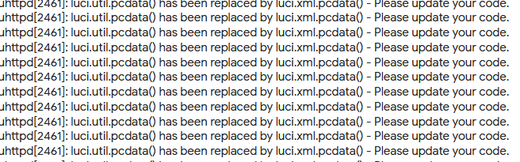
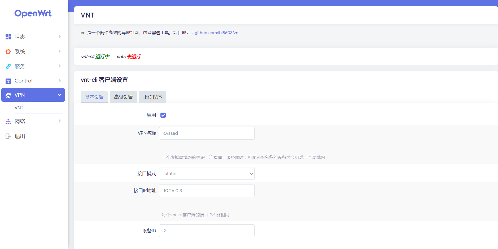
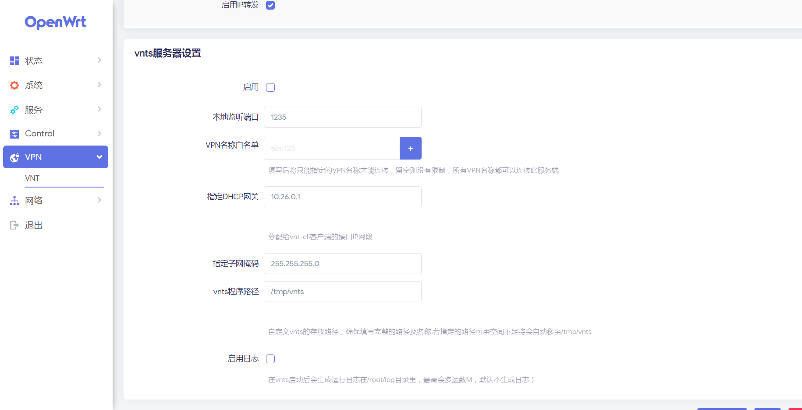
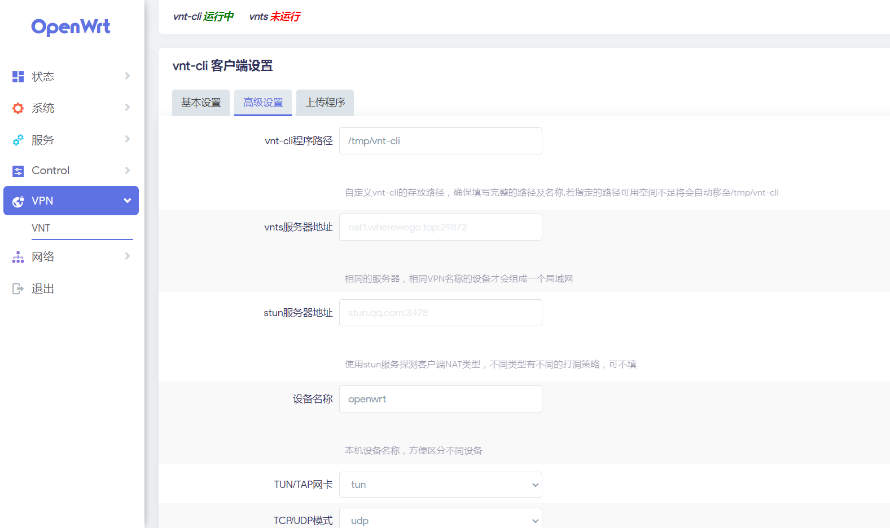
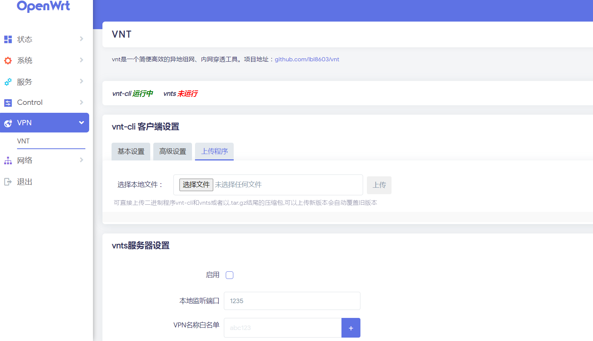
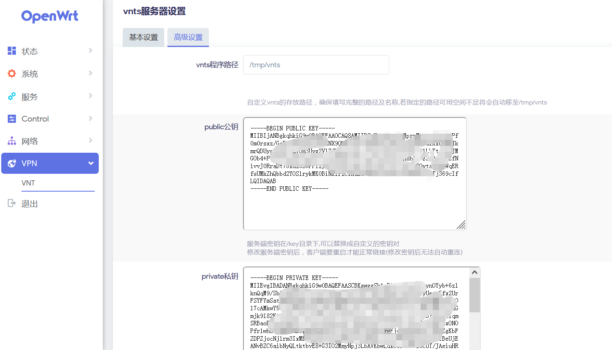
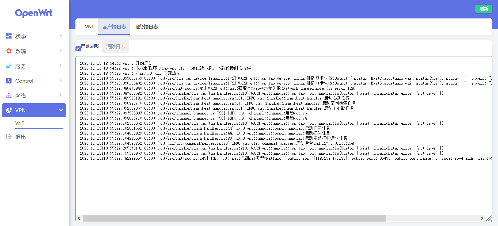

# luci-app-vnt
<p align="center">
	
<a href="https://hits.seeyoufarm.com"></a>
<a href="https://github.com/lmq8267/luci-app-vnt/releases"></a>
<a href="https://github.com/lmq8267/luci-app-vnt/graphs/contributors"></a>
<a href="https://github.com/lmq8267/luci-app-vnt/releases/"></a>
<a href="https://github.com/lmq8267/luci-app-vnt/issues"></a>
<a href="https://github.com/lmq8267/luci-app-vnt/discussions"></a>
<a href="GitHub repo size"></a>
<a href="https://github.com/lmq8267/luci-app-vnt/actions?query=workflow%3ABuild"></a>
</p>

项目地址：https://github.com/vnt-dev/vnt

非专业，编写自用，有大佬完善一下也好，自1.2.9版本起可以多开了，要是有大佬重写一个可以支持多开、多配置快速切换 就好啦，多配置快速切换

需要依赖komd-tun 手动去系统自带的软件包里先安装好吧

新版OpenWrt的APK包管理器安装后编译的APK包，由于签名证书不一致了，可能需要使用跳过证书验证的命令才能安装
```
apk add --allow-untrusted luci-app-vnt.apk
```

## 使用方法

- 只编译IPK或APK安装包的话，参考.github/workflows里的[CI.yml](.github/workflows/CI.yml) 可以直接在GitHub云编译。
- 将luci-app-lucky添加至 LEDE/OpenWRT 源码的方法。

### 下载源码方法:

 ```Brach
 
    # 下载源码
	
    git clone https://github.com/lmq8267/luci-app-vnt.git package/vnt
    make menuconfig
	
 ``` 
### 配置菜单

 ```Brach
    make menuconfig
	# 找到 LuCI -> Applications, 选择 luci-app-vnt, 保存后退出。
 ``` 
 
### 编译

 ```Brach 
    # 编译固件
    make package/vnt/luci-app-vnt/compile V=s
    #客户端程序
    make package/vnt/vnt/compile V=s
    #服务端程序
    make package/vnt/vnts/compile V=s
 ```

##

> 如果 状态-系统日志里 出现下图日志内容可以使用以下命令解决

<p></p>

```
sed -i 's/util/xml/g' /usr/lib/lua/luci/model/cbi/vnt.lua
```

##

### UI预览 ###







